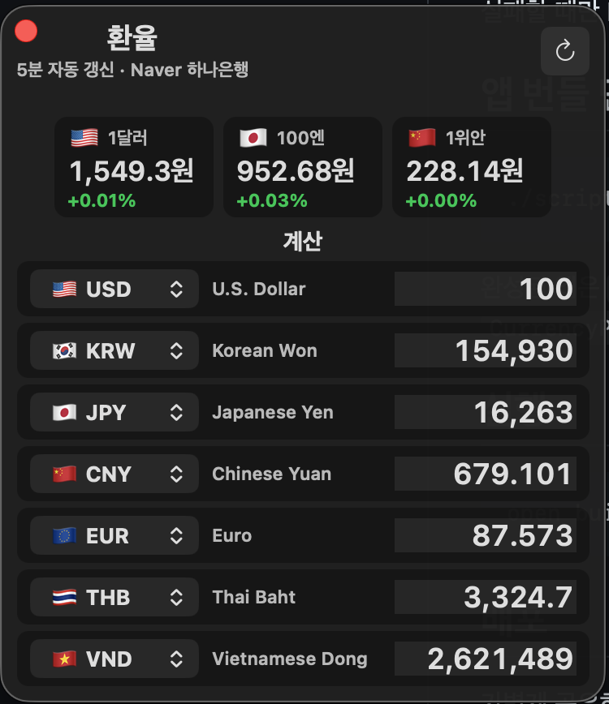

# CurrencyPanel

작고 빠르게 띄워두는 macOS 환율 패널입니다.

CurrencyPanel is a compact macOS currency panel designed to stay open on your desktop.



## 한국어 소개

CurrencyPanel은 macOS 데스크톱 한쪽에 항상 띄워두고 환율을 빠르게 확인하기 위한 작은 앱입니다.

브라우저를 열고 검색하거나, 포털 금융 페이지를 매번 확인하지 않아도 한국에서 자주 보는 기준 환율을 바로 볼 수 있습니다. 특히 해외 결제, 여행 준비, 해외 쇼핑, 투자, 외화 송금, 해외 서비스 가격 비교처럼 원화 기준 환율을 자주 확인하는 상황에 맞춰 만들었습니다.

상단에는 한국에서 많이 보는 기준 환율 3가지를 고정으로 보여줍니다.

- `1달러 = 원`
- `100엔 = 원`
- `1위안 = 원`

아래에는 다중 통화 계산기가 있습니다. USD, KRW, JPY, CNY, EUR, THB, VND 중 아무 칸에나 숫자를 입력하면 나머지 통화가 동시에 변환됩니다. 예를 들어 USD 칸에 `100`을 입력하면 원화, 엔화, 위안화, 유로, 바트, 베트남 동이 한 번에 계산됩니다. 반대로 KRW 칸에 원화 금액을 입력해도 다른 통화가 자동으로 다시 계산됩니다.

### 주요 기능

- macOS에서 작게 띄워두는 플로팅 환율 패널
- `1달러`, `100엔`, `1위안` 원화 환율 고정 표시
- USD, KRW, JPY, CNY, EUR, THB, VND 동시 변환
- 아무 통화 칸이나 수정하면 나머지 값 자동 계산
- 계산기 각 줄의 통화 변경 가능
- 5분마다 자동 갱신
- 수동 새로고침 버튼
- 이전 갱신값 대비 변화율 표시
- 숫자 입력칸 단축키 지원
  - `Cmd+A`: 전체 선택
  - `Cmd+C`: 복사
  - `Cmd+V`: 붙여넣기
  - `Tab`: 다음 칸
  - `Shift+Tab`: 이전 칸
  - `Esc`: 편집 종료
- macOS 앱 아이콘 포함

### 환율 데이터

CurrencyPanel은 한국 사용자가 익숙하게 보는 환율에 맞추기 위해 Naver 모바일 증권의 하나은행 고시 환율을 우선 사용합니다.

환율 소스 우선순위는 다음과 같습니다.

1. Naver 모바일 증권 하나은행 고시 환율
2. Yahoo Finance
3. ExchangeRate-API open endpoint

상단의 핵심 환율 카드와 아래 계산기는 같은 환율 스냅샷을 사용하므로, 앱 안에서 값이 서로 다르게 보이지 않도록 맞춰져 있습니다.

### 설치해서 사용하기

GitHub Releases에 미리 빌드된 파일이 올라와 있다면, 아래 페이지에서 `CurrencyPanel.zip` 또는 `.dmg` 파일을 다운로드하면 됩니다.

```text
https://github.com/LemonMuscat/Currency/releases
```

다운로드 후:

1. 압축을 풉니다.
2. `CurrencyPanel.app`을 실행합니다.
3. 원하면 `Applications` 폴더로 옮겨 사용합니다.

아직 Apple notarization을 하지 않은 빌드라면 macOS 보안 경고가 뜰 수 있습니다. 이 경우 앱을 우클릭한 뒤 **열기**를 선택하면 실행할 수 있습니다.

### 직접 빌드하기

이 프로젝트는 Xcode 프로젝트 없이 Command Line Tools와 AppKit으로 빌드합니다.

필요한 것:

- macOS
- Xcode Command Line Tools

빌드:

```sh
./scripts/build_app.sh
```

완성된 앱은 아래 위치에 만들어집니다.

```text
build/CurrencyPanel.app
```

실행:

```sh
open build/CurrencyPanel.app
```

### 다른 Mac에서 받아서 사용하기

```sh
git clone https://github.com/LemonMuscat/Currency.git
cd Currency
./scripts/build_app.sh
open build/CurrencyPanel.app
```

### `build/` 폴더를 GitHub에 올리지 않는 이유

`build/` 폴더 안의 `CurrencyPanel.app`은 소스코드가 아니라 빌드 결과물입니다.

일반적으로 GitHub 저장소에는 소스코드와 리소스, 빌드 스크립트를 올리고, 앱 실행 파일은 GitHub Releases에 별도 파일로 올립니다. 이렇게 해야 저장소가 가볍게 유지되고, 다른 사람도 소스에서 직접 빌드할 수 있습니다.

추천 구조는 다음과 같습니다.

- 저장소: `Sources/`, `Resources/`, `scripts/`, `README.md`
- 로컬 빌드 결과: `build/CurrencyPanel.app`
- 일반 사용자 다운로드: GitHub Releases의 `CurrencyPanel.zip` 또는 `.dmg`

### 배포

가볍게 공유하려면 앱을 zip으로 압축하면 됩니다.

```sh
./scripts/build_app.sh
cd build
zip -r CurrencyPanel.zip CurrencyPanel.app
```

그 다음 `CurrencyPanel.zip`을 GitHub Releases에 업로드하면 일반 사용자도 다운로드할 수 있습니다.

더 자연스러운 macOS 배포를 하려면 Apple Developer ID로 서명하고 Apple notarization을 거치는 것이 좋습니다. notarization이 없으면 사용자가 처음 실행할 때 우클릭 후 **열기**를 해야 할 수 있습니다.

---

## English Introduction

CurrencyPanel is a compact macOS currency panel designed to stay open on your desktop.

It is built for people who frequently need to compare Korean won with major currencies throughout the day. Instead of opening a browser, searching a finance website, or using a large converter app, CurrencyPanel gives you a small always-visible panel with the exchange rates and conversions you need most.

The top section shows three KRW-focused exchange cards that are commonly checked in Korea.

- `1 USD -> KRW`
- `100 JPY -> KRW`
- `1 CNY -> KRW`

Below that, CurrencyPanel provides a multi-currency calculator. You can edit any currency row, and all other rows update automatically. For example, entering `100` in the USD field instantly calculates KRW, JPY, CNY, EUR, THB, and VND. You can also type a KRW amount and convert it back into the other currencies.

### Features

- Compact floating macOS panel
- KRW-focused exchange cards for USD, JPY, and CNY
- Multi-currency calculator
- Edit any row and all other currencies update instantly
- Default calculator currencies:
  - USD
  - KRW
  - JPY
  - CNY
  - EUR
  - THB
  - VND
- Currency selector for each calculator row
- Automatic refresh every 5 minutes
- Manual refresh button
- Change indicators compared with the previous refresh
- Keyboard-friendly input
  - `Cmd+A`: select all
  - `Cmd+C`: copy
  - `Cmd+V`: paste
  - `Tab`: next field
  - `Shift+Tab`: previous field
  - `Esc`: finish editing
- macOS app icon included

### Exchange Rate Sources

CurrencyPanel prioritizes exchange rates that feel familiar to Korean users.

Source priority:

1. Naver mobile finance, Hana Bank exchange rates
2. Yahoo Finance
3. ExchangeRate-API open endpoint

The top exchange cards and the calculator use the same rate snapshot, so values stay consistent across the app.

### Installation for Users

If a prebuilt release is available, download it from the GitHub Releases page:

```text
https://github.com/LemonMuscat/Currency/releases
```

Then:

1. Download the `.zip` or `.dmg` file.
2. Open it.
3. Move `CurrencyPanel.app` to your Applications folder if desired.
4. Launch the app.

If the app is not notarized yet, macOS may show a security warning. In that case, right-click the app and choose **Open**.

### Build From Source

This project builds a native macOS AppKit app without an Xcode project.

Requirements:

- macOS
- Xcode Command Line Tools

Build:

```sh
./scripts/build_app.sh
```

The app bundle will be created here:

```text
build/CurrencyPanel.app
```

Run:

```sh
open build/CurrencyPanel.app
```

### Clone on Another Mac

```sh
git clone https://github.com/LemonMuscat/Currency.git
cd Currency
./scripts/build_app.sh
open build/CurrencyPanel.app
```

### Why Is `build/` Not Committed?

The `build/` folder contains generated files, including `CurrencyPanel.app`.

Generated app bundles are usually not committed to the source repository because they can be rebuilt from the source code and may be large or platform-specific.

For end users, prebuilt apps should be distributed through GitHub Releases, not committed directly into the main repository.

Recommended structure:

- Repository source code: `Sources/`, `Resources/`, `scripts/`, `README.md`
- Generated local build: `build/CurrencyPanel.app`
- Public downloadable app: GitHub Releases asset, such as `CurrencyPanel.zip` or `CurrencyPanel.dmg`

### Distribution Notes

For personal sharing or testing, you can zip the app bundle:

```sh
./scripts/build_app.sh
cd build
zip -r CurrencyPanel.zip CurrencyPanel.app
```

Then upload `CurrencyPanel.zip` to GitHub Releases.

For a smoother public macOS distribution experience, the app should eventually be signed with an Apple Developer ID and notarized by Apple. Without notarization, users may need to use right-click -> Open the first time they launch it.

## Project Structure

```text
Currency/
├── Resources/
│   ├── AppIcon.icns
│   ├── AppIcon.png
│   └── Info.plist
├── Sources/
│   ├── CurrencyPanel/
│   │   └── main.m
│   └── Launcher/
│       └── main.c
├── docs/
│   └── screenshot.png
├── scripts/
│   └── build_app.sh
└── README.md
```

## Implementation Note

CurrencyPanel uses a small launcher process that starts `CurrencyPanelRuntime` from inside the same app bundle. This keeps the runtime path stable for macOS window managers while preserving the app's lightweight floating-panel behavior.
